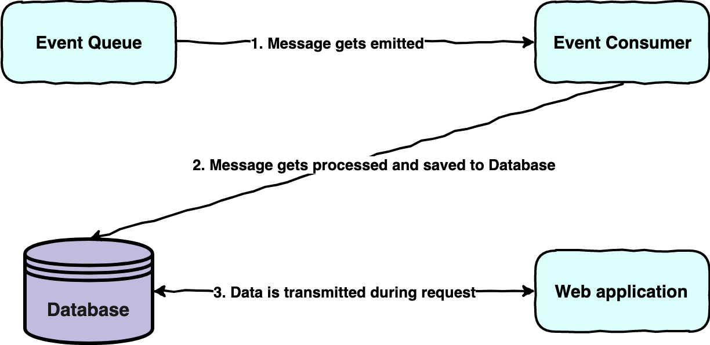
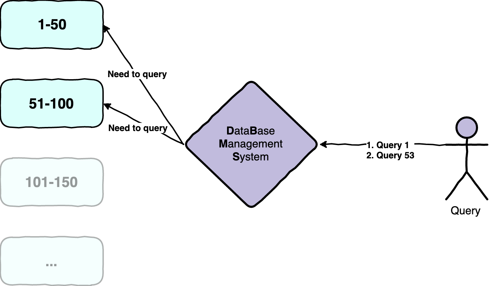

# Find rows from a list that do not exist in a PostgreSQL table

A lot of web applications have to deal with a lot of data. This data has to be saved into some database at some point in time. Those processes are normally done in big batches but making sure that every data entry was inserted into the database is quite hard.

To understand the main problem we are looking here at, let us look at the architecture of a system which could save a lot of data into the database.



This is a basic initial architecture without fallbacks on what happens during large data processing. The web application might or not have the data already when the request is sent from the consumer of the web application. Normally this happens in the frontend of the web application. But if the data is not available after it has been on the event queue it might leave two pieces of infrastructure in an error state. The event consumer could have failed to process the event but also the database could have failed to save the data. This scenario is quite common and could be fixed in a lot of ways but more importantly, when it happens, is to figure out when it occurs and which events are affected. The normal workflow to do this is:

1. Get logging information
2. Gather a list of lost events
3. Check if they exist in the database
4. Ingest the events again

The third step in this process can be quite tedious if the list is large.

```sql
SELECT * FROM example_table
WHERE id IN (
  1,
  53,
  ...
);
```

Because this list can get quite huge, the result will be somehow unreadable.

| id  | data |
| --- | ---- |
| 1   | ...  |
| ... | ...  |

If the list is large enough, no one is able to spot the actual missing data. So this approach is quite hard to handle then. It would require a lot more scripting to get the actual data we want.

But for this problem, we could adjust our SQL query to just show the entries which are not in the results without a lot of more work.

```sql
SELECT id
FROM (VALUES (1),
             (53),
             (...)) V(id)
    EXCEPT
SELECT id
FROM example_table;
```

Doing this query would result in the following output.

| id |
| -- |
| 53 |

Exactly what we wanted to achieve in the first place. Now we have a list of all ids which are missing. Based on this, we can work to recover the data.

The query under the hood is working quite fast when the property which is queries like the `id` in this code is indexed. If the value which should be queried for is not indexed it will become a lot harder to achieve.

One disadvantage of this query is that we do not query the additional data, unfortunately. But it is better than querying the data manually.

Under the hood, the query is working so fast because of how indexing is working in databases. The table is normally split into a tree. Quite confusing but let us have a look at the following diagram.



What PostgreSQL is doing, is that it will split the table internally in small tables which can be accessed fast. This is not the actual approach PostgreSQL will do but for simplification, we visualize it like this. So basically we have the following tables now:

- `1-50`
- `51-100`
- `101-151`
- `...`

The `...` table will be of course also chunked into 50 steps. It is also important to understand that the number `50` is kind of arbitrary. PostgreSQL has internal calculations making this as fast as possible. This is also highly complex, so we will not look at it here. But because PostgreSQL is managing this mapping internally and exactly knows which table to query for specific Ids this can be optimized a lot for fast access. In our query, not the whole table would be accessed but just the two parts `1-50` and `51-100`. The other parts would be untouched and the database management system would end the query just after those two parts have been queried.
