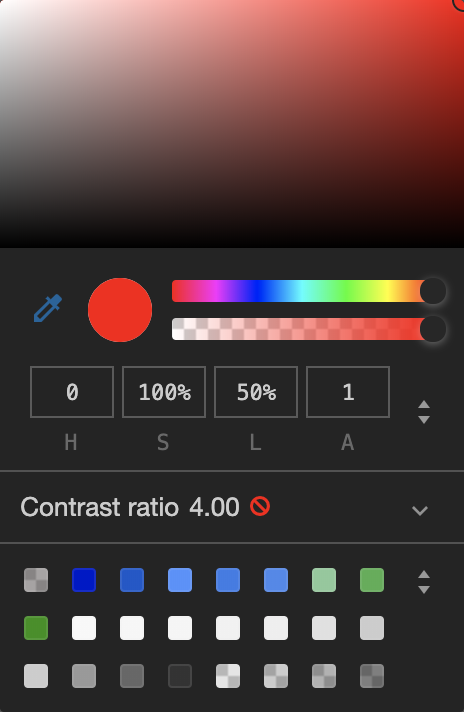

# Generating color schemas as developer: A simple guide

As a full-stack software engineer or frontend engineer, someone might be exposed to design decisions sometimes. Ranging from small design decisions in early stage startups to creating own projects, it might be needed sometime to choose colors for different user interface (UI) elements. This guide should help you choosing the optimal colors for a project if no colors have been defined or given to you.

First of all, most base colors can be copied from a lot of popular sites or taken from the sites presented in the next chapter. The populated color schemas will work well for most of the web applications you will create and will generate outstanding designs.

## Popular Color Schema Sites

In the internet a lot of color schema sites popped up in the last years. Most of them are curated and can be taken as good base for your own needs. A bad thing about the sites is that most of them are showcasing just five colors and for most applications this is not good enough. Engineers normally use opacity for different color shades but working with different background colors might result in different results. A yellow with opacity of `0.8` might look different on a black and a white background.

You can see in the middle and on the right how the base color from the left looks with a white background and with a black background. The colors are just completely different and it shows you should not use this pattern to create color shades. To discover the base color we can use one of the following color schema sites.

### coolors.co

[coloors.co](https://coolors.co/) is probably the most popular website to find color schemas. It is mostly praised as generator but what let the site really shine is the explorer or browsing menu. The [picks](https://coolors.co/browser/picks/1) and the [best](https://coolors.co/browser/best/1) search filters really offer a wide variety of color schemas which are really good.

### colorsandfonts

[colorsandfonts](https://www.colorsandfonts.com/) is quite a newcomer when it comes to design resources. But it really shines with a detail in design and really nice showcases. The color palettes you will find on the website are quite well differentiated and look really nice. The palettes can be found [here](https://www.colorsandfonts.com/palettes.html).

## The problem with the color palettes

Most often the color palettes provide a good base for colors but just five colors might be limited most often for elements. A button border which should have mostly the same color but just a bit different when it is focused. The following picture shows the problem if we would use opacity.

The button works great on a white background but on a dark background it loses it touch.

Instead we can generate a new color for the border which would work on a dark and bright background as the following picture suggests.

The color of the border of the button is more consistent on this picture and on the right since the color is not transparent att all. To generate colors like this, we need to learn first about HSL values which are explained in the next chapter.

## Use HSL instead of Hex

Web developers are mostly using hex codes for colors. But the hex color codes are actually bad to design with unfortunately. Instead there is the concept of HSL. It stands for:

- **H**ue: Is a degree on a color wheel. It goes from 0 to 360.
- **S**aturation: Goes from 0% to 100%. 0% is the color just grayed out.
- **L**ightness: Goes from 0% to 100%. If you set it to 100% the color will be white. If the value is set to 0% the color will be black.

You can observe the HSL colors quite good in your browser dev tools. On Mac on Chrome just open the dev tools with CMD+Option+J. Afterward, adding `color: hsl(0, 100%, 50%);` to some element will probably set you up to use the color picker in Chrome or Firefox.

Just enter the `S` (saturation) input box which is set to 100% in the example and play around with your up and down arrow keys. You can see where the circle in the color picker is going. When putting the saturation back to 100% and changing the 50% value with the up and down arrow, someone can feel how lightness is changing the color.

## Generate Shades of Colors

## Generate Colors for Different States

## First design without Color

Example base color schema: https://coolors.co/011627-fdfffc-2ec4b6-e71d36-ff9f1c
